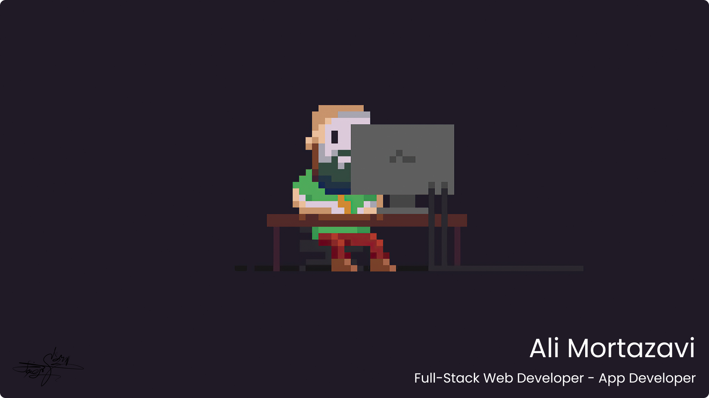

<h2>Hey there! I'm Ali</h2>

## 👋 &nbsp;Hey there! I'm Ali

### 👨🏻‍💻 &nbsp;About Me

💡 &nbsp;I am Ali Mortazavi. I am a back-end specialist and a full-stack programmer.\
🎓 &nbsp;I started programming when I was 13 years old and I have a lot of experience and I have finished many projects.\

### 🛠 &nbsp;Tech Stack

&nbsp;
&nbsp;
&nbsp;
&nbsp;
&nbsp;
&nbsp;
&nbsp;
\
&nbsp;
&nbsp;
&nbsp;
&nbsp;
&nbsp;
 
 
 

### ⚙️ &nbsp;GitHub Analytics

### 🤝🏻 &nbsp;Connect with Me

---

Credits: [Ali Mortazavi](https://github.com/alimortazavi-pr)
