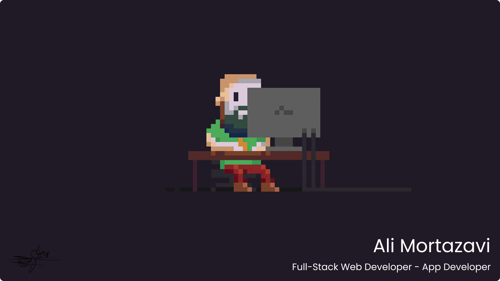

# Hi, I'm Ali Mortazavi 👋

### Full-Stack JavaScript Developer — React/Next.js & Node.js/NestJS

---

### 👨‍💻 About Me

- 💡 I'm a **JavaScript developer** focused on building modern web apps end-to-end.
- 🎨 On the **front-end**, I mainly work with **React** and **Next.js**.
- ⚙️ On the **back-end**, I love working with **Node.js** and **NestJS**.
- 🎓 I started programming at 13 and have shipped many projects since then.
- 🌐 Personal site: **[alimor.ir](https://alimor.ir)** &nbsp;|&nbsp; Brand: **[paradisecode.ir](https://paradisecode.ir)**
- 📈 Currently exploring **futures trading** alongside development.
- 🗣️ Learning English — feel free to reach out, I'm always improving!

 

### 🛠 Tech Stack

**Front-End**

&nbsp;
&nbsp;
&nbsp;
&nbsp;
&nbsp;
&nbsp;
&nbsp;

**Back-End**

&nbsp;
&nbsp;
&nbsp;
&nbsp;
&nbsp;

**Tools**

&nbsp;
&nbsp;
&nbsp;
&nbsp;
&nbsp;

 

### ⚙️ GitHub Analytics

  
  

 

### 🤝 Let's Connect

  
  
  
  
  

---

Credits: [Ali Mortazavi](https://github.com/alimortazavi-pr)

